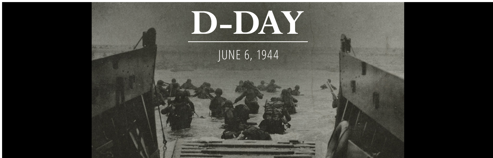
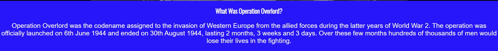
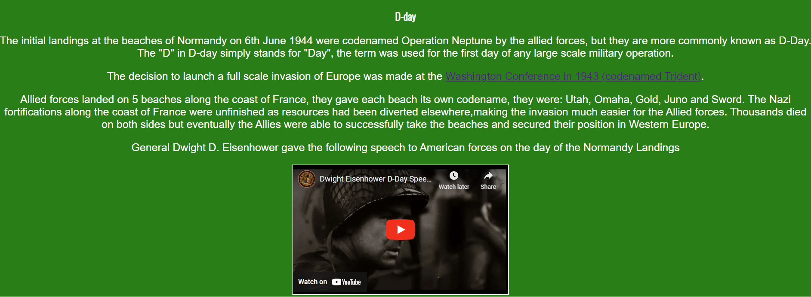
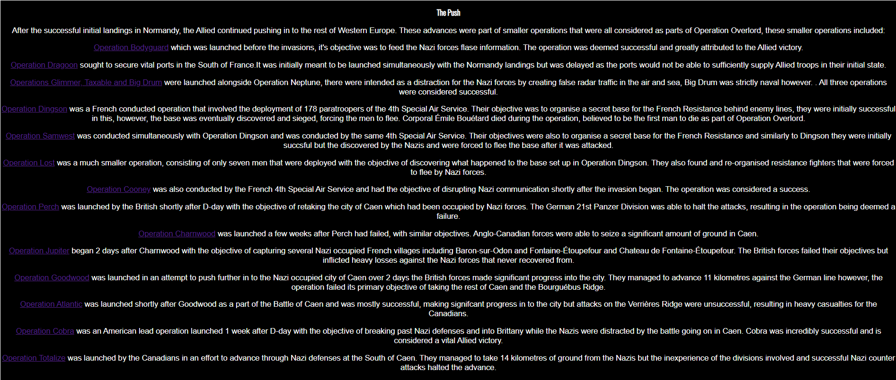
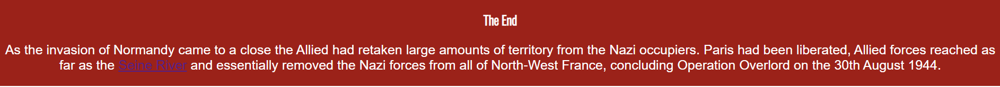
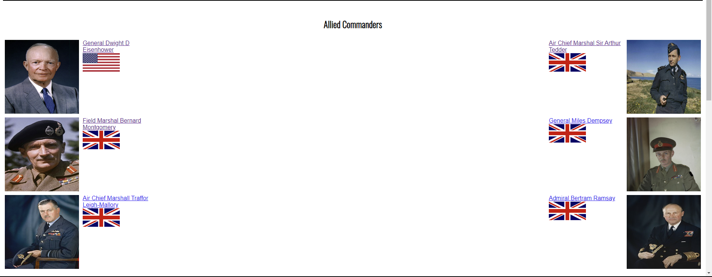
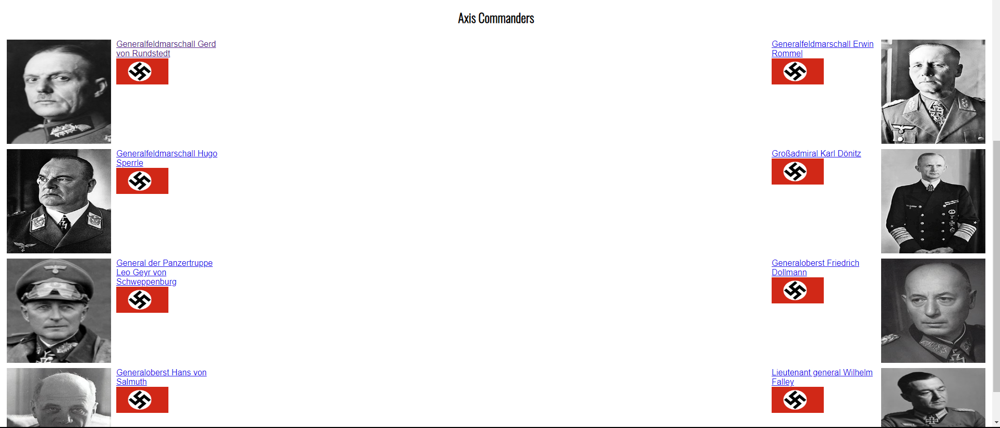
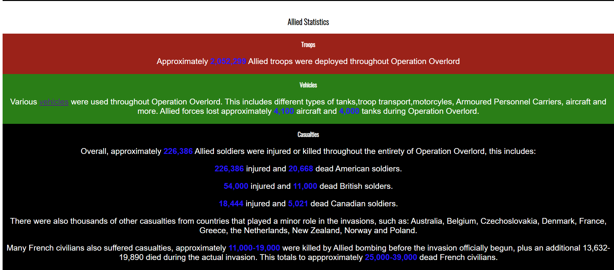
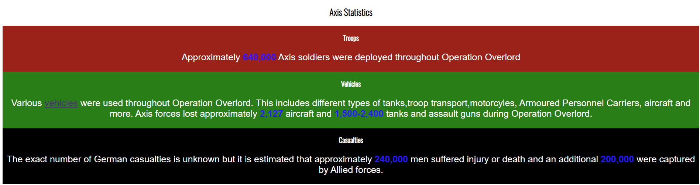

# Operation Overlord
Operation Overlord is a site dedicated to providing accurate and up to date information regarding the Normandy Invasions that occured during World War 2, code named "Operation Overlord". It is for anybody who is curious about the topic and looking to learn more about the events of the invasions. 

## Features

### Existing Features

#### Navigation Bar
All 3 pages contain a navigation bar that takes users to the 3 seperate pages of the website.
This allows the user to easily navigate the website, whereever they are.
The logo also acts as a home button.

#### Hero Image
The home page contains a hero image that immediately lets the user know what the website is about.

#### Home Page

The home page contains several sections containing relevant information for the events of Operation Overlord.

##### What was Operation Overlord

This section gives a brief rundown on what Operation Overlord actually was.

##### D-day

This section gives a brief rundown of the events of D-day.
It also includes an embedded youtube video of a speech given by Dwight D. Eisenhower on D-day.

##### The Push

This section describes the multiple smaller operation that the Allied forces launched after the initial landings in order to gain more ground throughout North West France.

It also contains links to each operation's wikipedia page.

##### The End

This section briefly describes how the opepration came to a close.

#### Commanders

The Commanders section displays images of commanders of both the Allied and Axis forces.

It also contains links to their respective wikipedia pages and an image of the flag of the countries each commander was from.

#### Statistics

This section gives a brief overview of several statistics regarding the operation. Such as the number of troops and vehicles deployed for both sides, and their casualties.

Numbers are highlighted in blue to make them stand out from the normal text.

