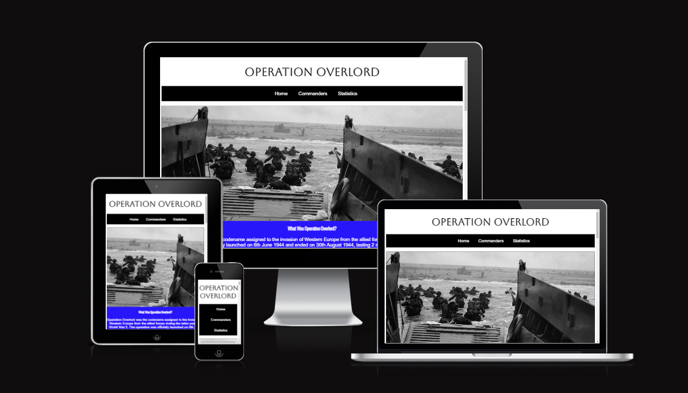
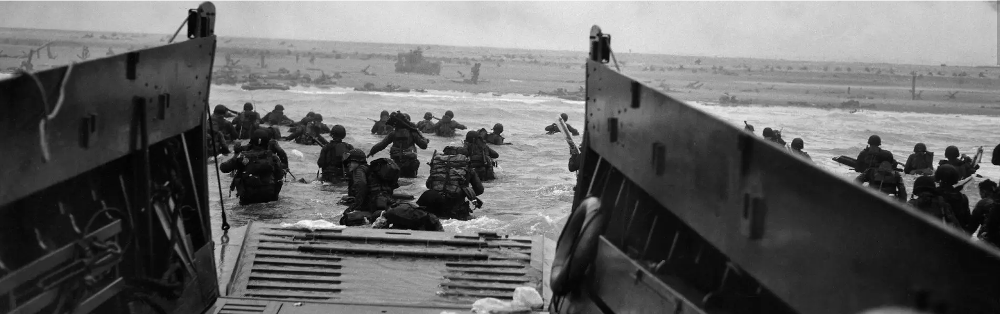
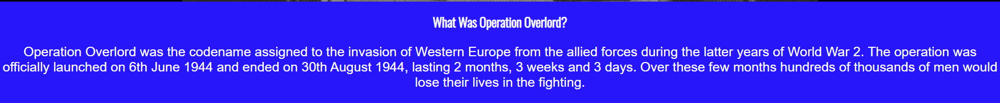
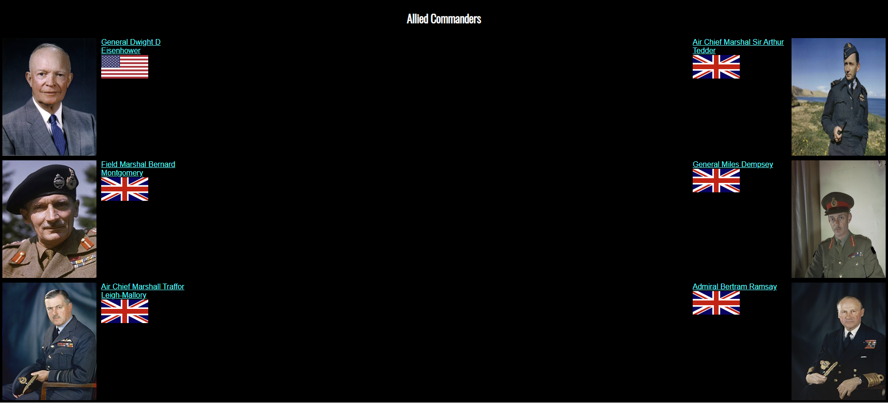
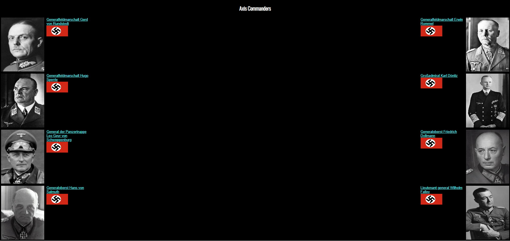
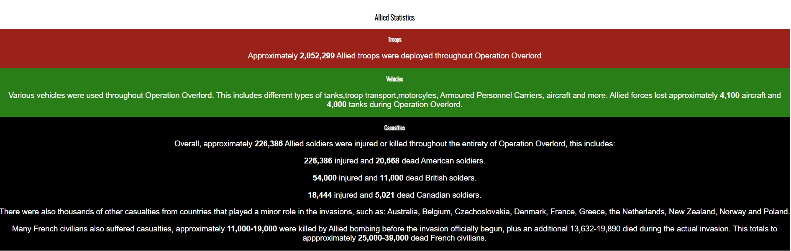
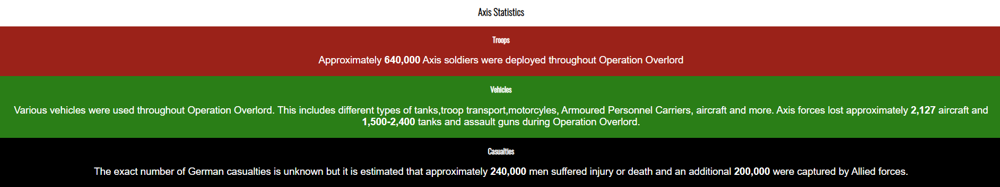
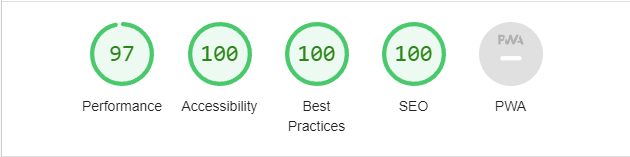

# Operation Overlord
Operation Overlord is a site dedicated to providing accurate and up to date information regarding the Normandy Invasions that occured during World War 2, code named "Operation Overlord". It is for anybody who is curious about the topic and looking to learn more about the events of the invasions. 

## Features

### Existing Features

#### Navigation Bar
All 3 pages contain a navigation bar that takes users to the 3 seperate pages of the website.
This allows the user to easily navigate the website, whereever they are.
The logo also acts as a home button.

#### Hero Image
The home page contains a hero image that immediately lets the user know what the website is about.

#### Home Page

The home page contains several sections containing relevant information for the events of Operation Overlord.

##### What was Operation Overlord

This section gives a brief rundown on what Operation Overlord actually was.

##### D-day

This section gives a brief rundown of the events of D-day.
It also includes an audio element that plays a speech given by Dwight D. Eisenhower to American soldiers on D-day.

##### The Push

This section describes the multiple smaller operation that the Allied forces launched after the initial landings in order to gain more ground throughout North West France.

It also contains links to each operation's wikipedia page.

##### The End

This section briefly describes how the opepration came to a close.

#### Commanders

The Commanders section displays images of commanders of both the Allied and Axis forces.

It also contains links to their respective wikipedia pages and an image of the flag of the countries each commander was from.

#### Statistics

This section gives a brief overview of several statistics regarding the operation. Such as the number of troops and vehicles deployed for both sides, and their casualties.

Numbers are emboldened to make them stand out from the normal text.

### Testing
All sections of the site function as expected, easily allowing users to achieve their goals with the website.

The site functions on large and small screen sizes, and has been tested on Chrome, Firefox and Edge. 

When initially uploaded to Github pages, the site was not loading any CSS or images. This was fixed by altering the file paths from "../assets---" to "./assets---".

#### Validator Testing

All HTML passes the W3C validator test.

All CSS passes the W3C validator test.

#### Accesibility
Lightouse dev tools confirms that the website is accesible to those with disabilities.

### Deployment
The site was deployed to GitHub pages. The steps to deploy are as follows:
In the GitHub repository, navigate to the Settings tab
From the source section drop-down menu, select the Master Branch
Once the master branch has been selected, the page will be automatically refreshed with a detailed ribbon display to indicate the successful deployment.

The live link can be found here - https://tylermorgan142.github.io/Operation-Overlord/

### Credits

#### Content
All pages includes content from https://en.wikipedia.org/wiki/Operation_Overlord.

The D-day section includes content from 
https://theddaystory.com/discover/what-is-d-day/#:~:text=The%20majority%20of%20troops%20who
https://obamawhitehouse.archives.gov/the-press-office/2014/06/06/fact-sheet-normandy-landings#:~:text=From%20D%2Dday%20through%20August,240%2C000%20casualties%20and%20200%2C000%20captured.
https://www.iwm.org.uk/history/the-10-things-you-need-to-know-about-d-day#:~:text=The%20'D'%20in%20D%2D,%2C%20Gold%2C%20Juno%20and%20Sword.

#### Media
The hero image is taken from 
https://www.nytimes.com/2019/06/06/world/europe/d-day-photos-anniversary-pictures.html
The images used in the Commanders section were mostly taken from their repsective wikipedia pages. With the exception of General der Panzertruppe Leo Geyr von Schweppenburg which was taken from 
https://ww2gravestone.com/people/geyr-von-schweppenburg-leo-dietrich-franz-freiherr-von/.

The code for the youtube video is embeded directly from the video.